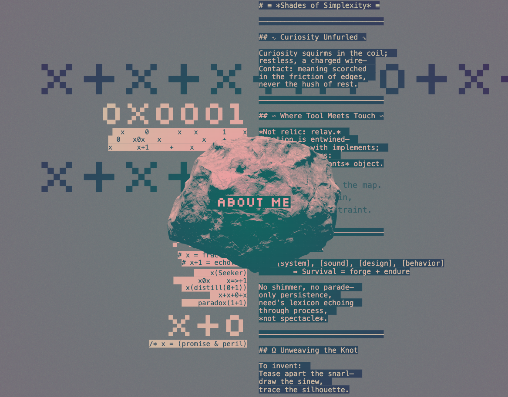
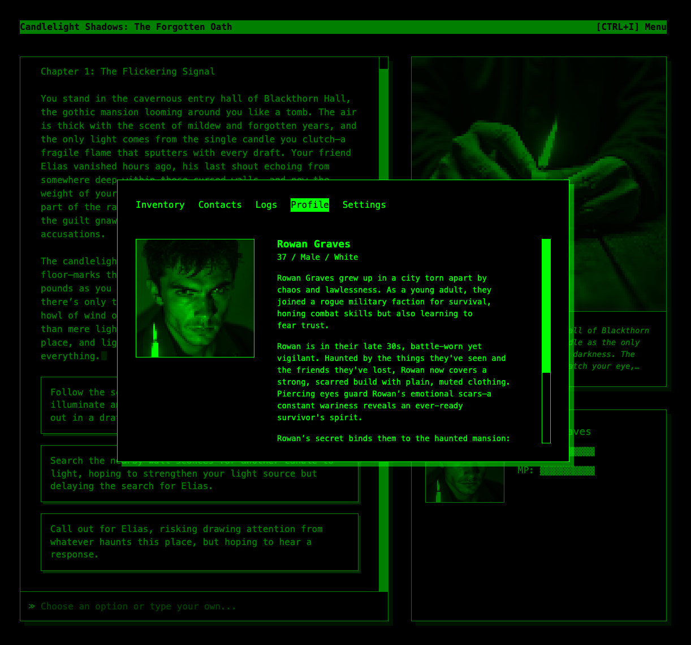
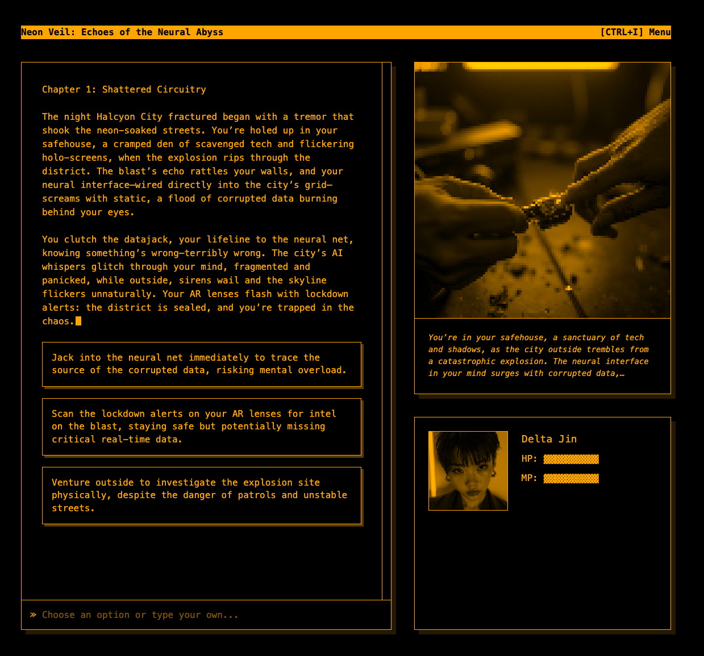

## A place for my tinkerings, playing with NextJS and Vercel's AI SDK and Gateway.

### About Me: https://garden.subpopular.dev
- (WIP) Experimenting with LLM, using endless feedback and prompt engineering to tell my personaly story - with some added typographic tinkering and 3D rock.

#### screengrab

--- 

### Retro Interactive Fiction: https://garden.subpopular.dev/game
- (WIP) Experimenting with LLMs and various image gen models (Flux, Stable Diffusion) to create a generative RPG, a bit of 'choose your own adventure' with endless possibilities. Retro-inspired UI with some fun UX details.
- Needs some added security to prevent misuse - I'll keep the API credits topped up until then for anyone that's curious.

#### screengrabs

